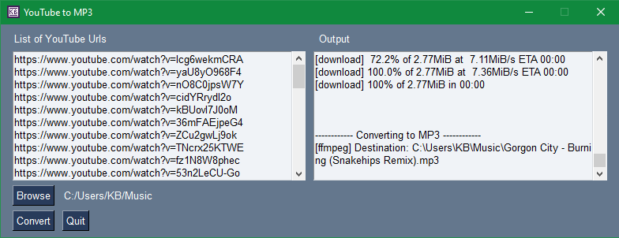
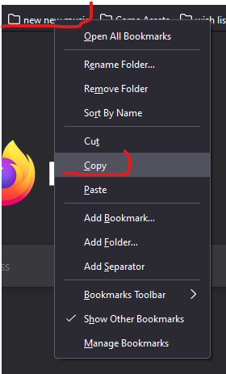
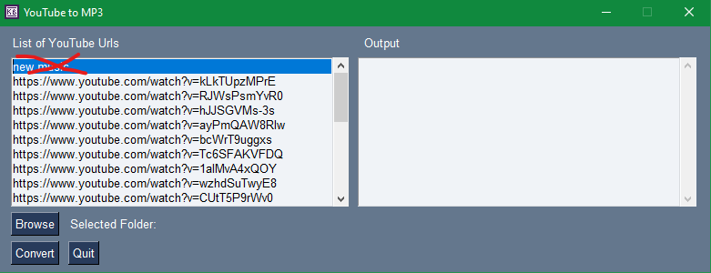
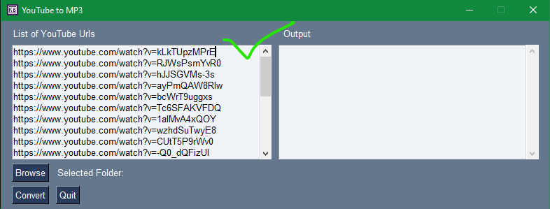
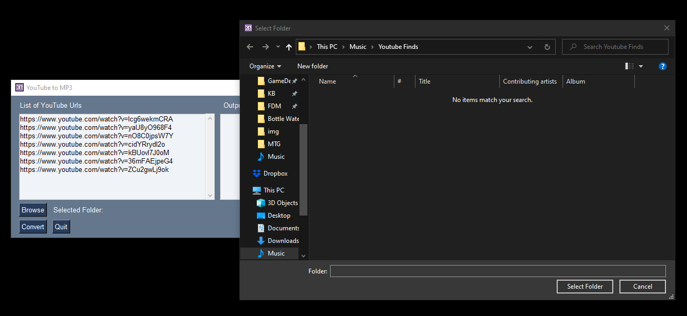
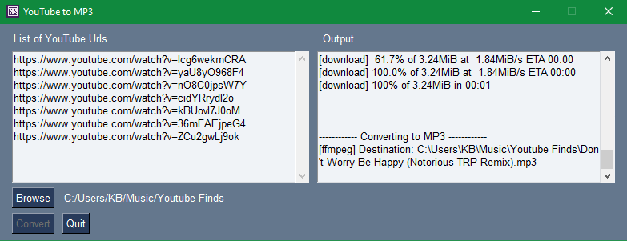
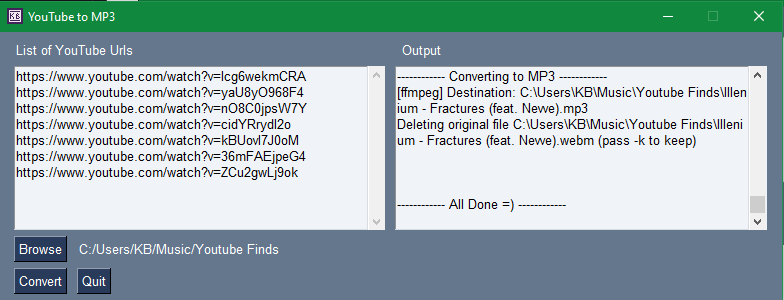

# YouTube to MP3 GUI Tool
[Windows exe found here](<place-hold>)
GUI tool to download a single or list of YouTube videos as MP3s. Simply copy and paste your desired YouTube videos url, separated by a new line. Select the destination folder and click convert. If there is an issue, usually cause by videos becoming unavailable in your country or the video being removed by the author, you will be givin a list of failed urls.

I usually go down the YouTube music rabbit hole on occasion. When I do, I bookmark everything I like to a _new music_ folder and forget about it for 3 months. I wanted an easy way to grab the MP3's and knew about an simple Python lib called youtube_dl. So I hacked together a working script, googled the easiest GUI lib, and slapped some inputs and buttons on the screen. This is the result so far, enjoy!

## Version Info
- Python 3.6
- pipenv 2018.11.26
- youtube_dl 2021.6.6
- PySimpleGUI 4.45.0

## Libs Used
- [PySimpleGUI](https://github.com/PySimpleGUI/PySimpleGUI)
- [youtube_dl](https://github.com/ytdl-org/youtube-dl)
- [pyinstaller](https://github.com/pyinstaller/pyinstaller)

## Compile (Windows only)
Build steps to create a .exe binary

- Must `pip install youtube_dl PySimpleGUI` **OUTSIDE** of pipenv to compile to binary
    - Needs to compile from root env, not in pipenv or other virtual envs
    - Install and build youtube_dl and PySimpleGUI in a terminal not within pipenv if you wish to compile an exe

##### Build
- `$ pip install pyinstaller`
- `$ pyinstaller yt-to-mps.py --onefile --noconsole`
- exe is in `dist/<script-name>.exe`
- you can delete `build/`, `/<name>.spec`, these are only used to compile

## Install and Run
- `$ git clone git@github.com:techb/YT-MP3-DL.git`
- `$ pipenv shell`
- `$ pipenv install`
- `$ python yt-to-mp3.py`

---

## Example using bookmark folder
- Right click the desired folder containing youtube urls
- Paste into URL list
    - Can also use a CSV if pasting from another source
    commas will be removed before loading in the URLs
- Remove non youtube url label
- _[Browse]_ to desired folder to save your new MP3's
- _[Convert]_ starts the conversion process
- All done!

